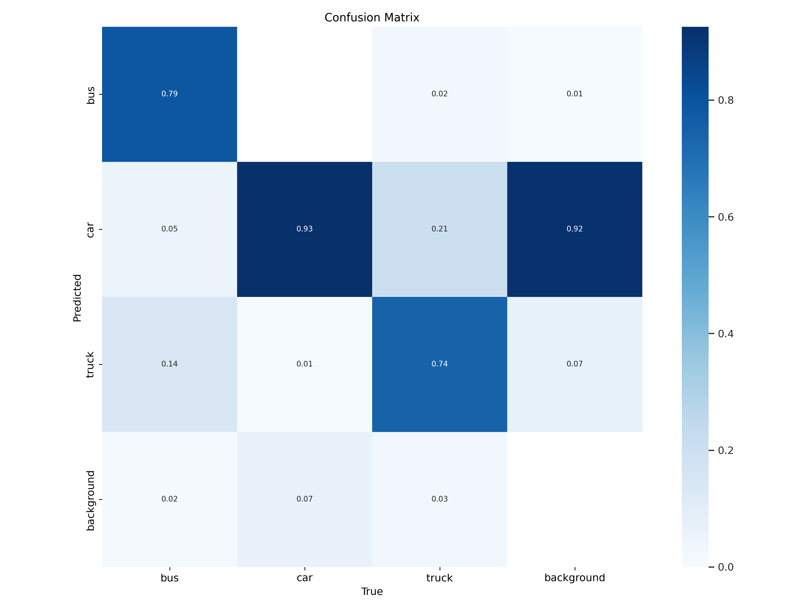
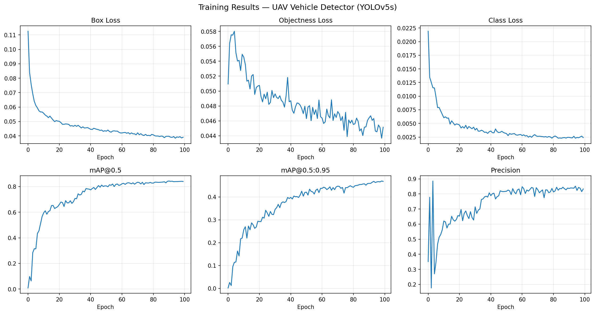
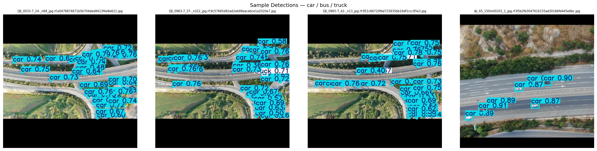

# UAV Vehicle Detection

Detection of vehicles (bus, car, truck) from aerial drone imagery using YOLOv5.
Developed during my summer internship at **DRDO-DEAL** (Defence Research and Development Organisation).

[](https://colab.research.google.com/github/RaunaqDavidNath/YOLO_DRDO_OBJ_DETECTION/blob/main/colab_train.ipynb)

---

## Problem Statement

Detecting vehicles from UAV/drone footage is harder than ground-level detection:

- **Top-down perspective** removes most distinguishing side-profile features
- **High visual similarity** between buses and trucks in plan view
- **Small object size** — vehicles appear as small as 20×20 pixels at high altitude
- **No fixed orientation** — vehicles appear at all rotation angles

---

## Model

| Property | Value |
|---|---|
| Architecture | YOLOv5s (small) |
| Input size | 640 × 640 px |
| Classes | bus · car · truck |
| Parameters | ~7.0 M |
| Pre-trained on | COCO → fine-tuned on aerial dataset |
| Training | 100 epochs, batch 16, Tesla T4 GPU |

### Aerial-specific design choices

I tuned the augmentation hyperparameters (`hyp_uav.yaml`) for the top-down setting,
since the YOLOv5 defaults assume ground-level imagery:

| Hyperparameter | Default | This project | Reason |
|---|---|---|---|
| Rotation | 0° | ±15° | aerial views have no fixed orientation |
| Vertical flip | disabled | 0.5 | valid transform from top-down |
| Scale | 0.5 | 0.6 | simulate varying drone altitude |
| Mixup | disabled | 0.1 | better generalisation across scenes |

---

## Results

Evaluated on the held-out **test set** (857 images, 25,103 instances):

| Metric | Value |
|---|---|
| mAP@0.5 | **0.854** |
| mAP@0.5:0.95 | **0.472** |
| Precision | 0.861 |
| Recall | 0.789 |

**Per-class performance:**

| Class | Instances | Precision | Recall | mAP@0.5 | mAP@0.5:0.95 |
|---|---:|---:|---:|---:|---:|
| car | 24,149 | 0.928 | 0.850 | 0.905 | 0.425 |
| bus | 198 | 0.888 | 0.783 | 0.855 | 0.548 |
| truck | 756 | 0.767 | 0.733 | 0.803 | 0.443 |

Trucks are the hardest class: from above they are easily confused with both buses
and large cars, which lowers their precision relative to the other two. The
confusion matrix below makes this visible.

**Confusion matrix:**



**Training curves:**



**Sample detections:**



---

## Dataset

The dataset consists of drone footage frames from DJI cameras, annotated with
YOLO-format bounding boxes for 3 vehicle classes (`bus`, `car`, `truck`).

| Split | Images |
|---|---|
| train | 2,097 |
| val | 841 |
| test | 857 |

The dataset is hosted on Roboflow and downloaded automatically by the Colab
notebook:
[UAV Vehicle Detection on Roboflow Universe](https://universe.roboflow.com/drdo-pylxb/uav-vehicle-detection-9t43s/dataset/1)

### Dataset preparation scripts (optional)

These two helpers were used to host the dataset on Roboflow. You only need them
if you are recreating the dataset from raw images — normal training pulls the
dataset straight from Roboflow via the Colab notebook.

Both expect a local `aerial dataset/` folder with `images/{train,val,test}/` and
`labels/{train,val,test}/`.

**`make_roboflow_zip.py`** — packs a 2,000-image train subset (full val/test) into
`roboflow_upload.zip` for drag-and-drop upload in the Roboflow UI:

```bash
python3 make_roboflow_zip.py
```

**`upload_to_roboflow.py`** — uploads images + labels to Roboflow via the API.
The Roboflow **Private API key** is read from an environment variable and is never
stored in the code:

```bash
export ROBOFLOW_API_KEY="your_private_key_here"   # Settings → Roboflow API
python upload_to_roboflow.py
```

After uploading, generate a dataset version in the Roboflow UI (skip Roboflow
augmentations — `hyp_uav.yaml` handles those in YOLOv5).

---

## Training (Google Colab)

1. Click the **Open in Colab** badge above
2. Go to `Runtime → Change runtime type → T4 GPU`
3. Run all cells

The notebook handles the full pipeline: downloading the dataset from Roboflow,
installing YOLOv5, training for 100 epochs, evaluating on the test set, and
saving the weights and result plots to Google Drive.

---

## Local Inference

```bash
# Clone the repo
git clone https://github.com/RaunaqDavidNath/YOLO_DRDO_OBJ_DETECTION
cd YOLO_DRDO_OBJ_DETECTION

# Install dependencies
pip install -r requirements.txt
git clone https://github.com/ultralytics/yolov5

# The trained model (best.pt) ships with this repo. Run detection:
python yolov5/detect.py \
  --weights best.pt \
  --source  path/to/images \
  --imgsz   640 \
  --conf    0.25
```

---

## Repository Structure

```
├── best.pt                 # Trained YOLOv5s model weights
├── colab_train.ipynb       # End-to-end Colab training notebook
├── datauav.yaml            # Dataset configuration (classes, paths)
├── hyp_uav.yaml            # Aerial-tuned augmentation hyperparameters
├── make_roboflow_zip.py    # Pack dataset for Roboflow upload
├── upload_to_roboflow.py   # Upload dataset to Roboflow
├── requirements.txt        # Python dependencies
├── training_curves.png     # Training metric curves
├── inference_samples.png   # Example detections on test images
├── confusion_matrix.png    # Per-class confusion matrix
├── results/                # results.csv + PR / metric plots
└── .gitignore
```

---

## How the Aerial Challenges Were Handled

**Bus vs. truck confusion:** From a top-down view a loaded truck and a bus have
near-identical rectangular footprints. Mosaic augmentation co-locates multiple
vehicle types in one training sample, helping the model learn the subtle
structural cues that separate them.

**Rotation invariance:** Aerial vehicles appear at any angle, so I added ±15°
rotation and 50% vertical-flip augmentation to stop the model overfitting to a
single orientation.

**Small object detection:** YOLOv5's multi-scale detection head (P3/8, P4/16,
P5/32) handles small objects at the finest scale, and mosaic augmentation widens
the range of object scales seen during training.

---

## Credits

- [Ultralytics YOLOv5](https://github.com/ultralytics/yolov5) — base framework (AGPL-3.0)
- Dataset collected during my DRDO-DEAL internship (June–July 2025)
